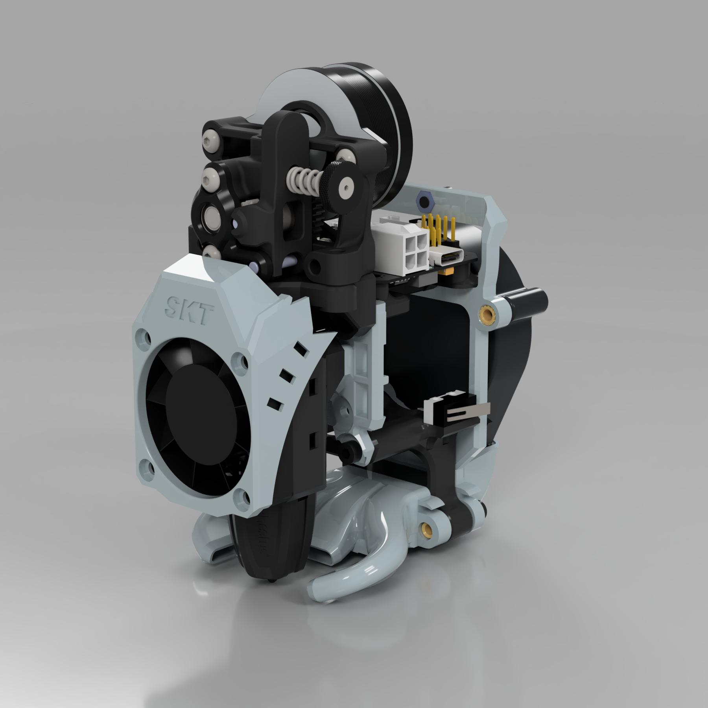
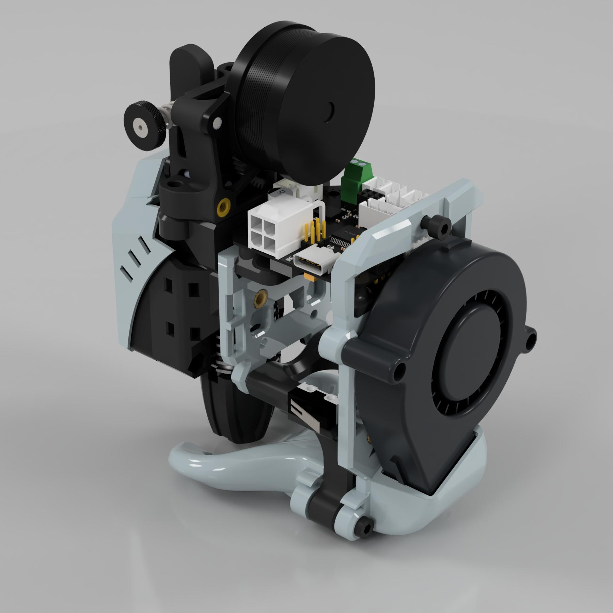
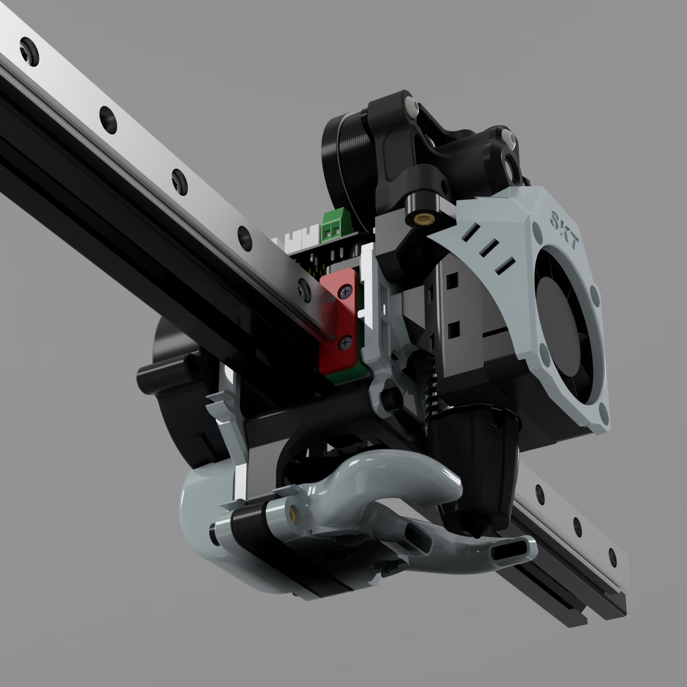

# Voron SKT Toolhead
Mod for Voron 2.4 (no Trident at the moment)
 
 
 
 
 
 

STK stands for "Skinny Tool" :) 
Some things are inspired by EVA 2, thanks guys. 
This toolhead is designed to be as light as possible. It will not be compatible with all extruders and all hotends or even with all types of toolboards due to its design and specificity. 
If you want to run, just try it.  

There will be a CPAP cooling system as soon as possible (and will be compatible with Trident as well)